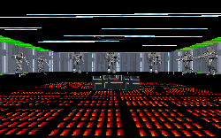

I was disappointed with this level. I enjoyed the premise of going back to the facility where the Dark Trooper first originated, but while going through the whole thing, I just felt like it failed to deliver. There are Dark Troopers of course, and even an interesting room with protoypes of them, but I never saw what I would think of as a great research facility. There where no construciton lines, or even a lab. After completion I was let down.

The other thing which really irks me is that the author didn't seem to feel that the player should accomplish anything in the level. You get to run through and "wreak some havoc", but you don't discover anything, there aren't any difficult puzzles, and the author fails to develop some of his storylines from the text file.

What the author does do is set up an interesting setting, an underground facility. Descending through the caverns was fun, and he did a good job to make it that way. His texture placement was good, although the green lights did get a little annoying. His design was nice too, especially near the end. He also managed to alter the Dark Trooper weapon, which was interesting. The slideshow he created was a nice replacement for the cutscenes, and did display some creativity.

## Overall

What can I really say in summary? I didn't really like it, but I didn't hate it. It's not bad, it's not great, it's just kind of so-so. Grab it if you want, but don't expect too much out of it.
